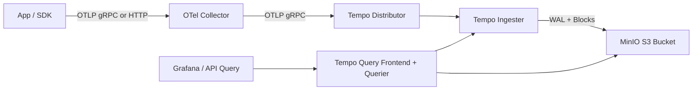
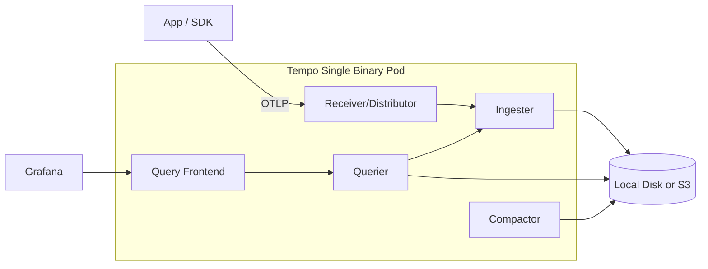
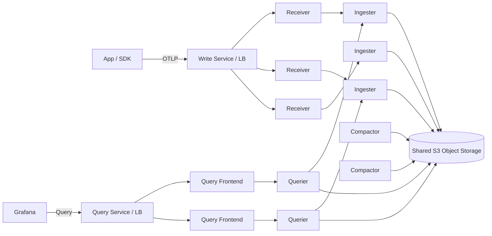
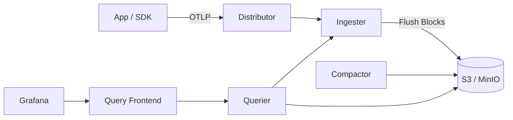
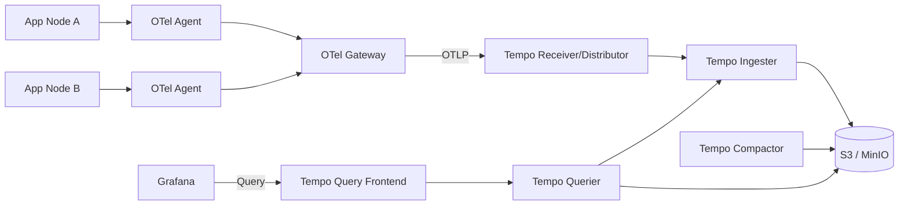

# Tempo + OTel Research

This repo runs Grafana Tempo with MinIO object storage and an OpenTelemetry Collector.

## Current Setup In This Repo

- Tempo image: `grafana/tempo:2.10.1`
- MinIO S3-compatible object storage
- OTel Collector forwarding traces to Tempo
- Kubernetes manifests:
  - `tempo-config.yaml`
  - `tempo-deployment.yaml`
  - `tempo-service.yaml`
  - `minio.yaml`
  - `otel-collector-config.yaml`
  - `otel-collector-deployment.yaml`
  - `otel-collector-service.yaml`

## OTel Trace Flow (Current)



## Four Tempo Deployment Types

Below are four practical Tempo architecture types used in real deployments.

### 1) Single Binary (Monolithic)

- One Tempo process handles all roles (receiver/distributor, ingester, querier, query-frontend, compactor).
- Best for local dev, testing, and small workloads.



### 2) Scalable Single Binary

- Multiple Tempo single-binary replicas behind a service (each replica includes receiver, ingester, querier, query-frontend, compactor).
- Keeps simple operations but allows horizontal scale.



### 3) Microservices (Distributed Tempo)

- Tempo components are split: distributor, ingester, querier, query-frontend, compactor.
- Best for large scale and independent component scaling.



### 4) Agent/Gateway Pattern (OTel + Tempo)

- OTel agents run near apps, optional central OTel gateway layer, then Tempo backend (receiver/distributor, ingester, querier, query-frontend, compactor).
- Best for centralized processing, filtering, retries, and multi-signal pipelines.



## Quick Apply

```bash
kubectl apply -f minio.yaml
kubectl apply -f tempo-config.yaml
kubectl apply -f tempo-deployment.yaml
kubectl apply -f tempo-service.yaml
kubectl apply -f otel-collector-config.yaml
kubectl apply -f otel-collector-deployment.yaml
kubectl apply -f otel-collector-service.yaml
```

## Notes

- For in-cluster OTLP receivers, bind endpoints to `0.0.0.0` (not `127.0.0.1`).
- Ensure bucket `tempo` exists in MinIO before Tempo starts.
